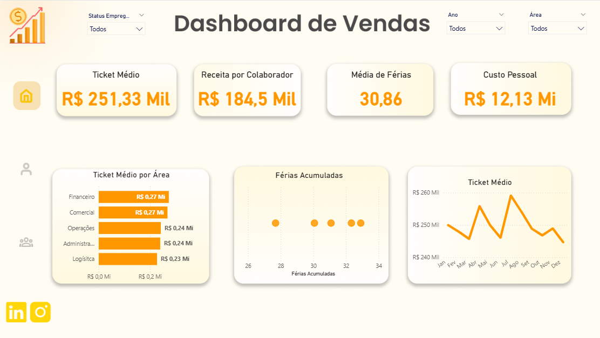
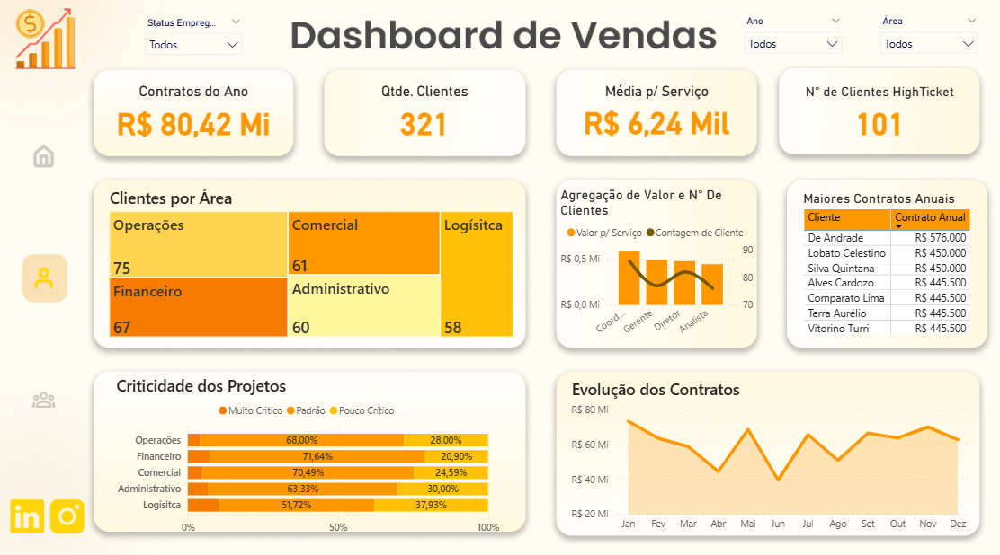
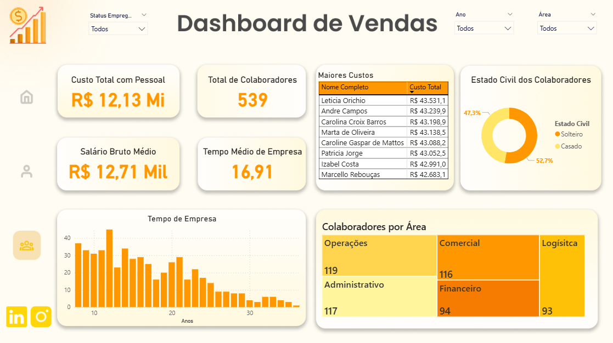

# 📊 Dashboard de Vendas - Power BI

Este projeto apresenta um **Dashboard de Vendas** desenvolvido no **Power BI**, com o objetivo de fornecer uma visão clara e interativa sobre indicadores de desempenho comercial, gestão de clientes e análise de colaboradores.

## 📌 Funcionalidades

- **Visão Geral de Vendas**
  - Total de contratos do ano
  - Quantidade de clientes
  - Média por serviço
  - Clientes High Ticket
  - Maiores contratos anuais
  - Evolução mensal dos contratos

- **Análise de Clientes**
  - Clientes por área
  - Criticidade dos projetos
  - Agregação de valor e número de clientes

- **Recursos Humanos**
  - Custo total com pessoal
  - Total de colaboradores
  - Salário bruto médio
  - Tempo médio de empresa
  - Colaboradores por área
  - Estado civil dos colaboradores

- **Indicadores Financeiros**
  - Ticket médio
  - Receita por colaborador
  - Média de férias
  - Ticket médio por área
  - Férias acumuladas

---

## 📷 Capturas de Tela

### Tela Inicial

### Visão Geral

### Clientes

### Recursos Humanos

---

## 🛠️ Tecnologias Utilizadas

- **Power BI**
- **Microsoft Excel** (tratamento de dados)
- **DAX** (cálculos e métricas personalizadas)
- **FIGMA**

---

